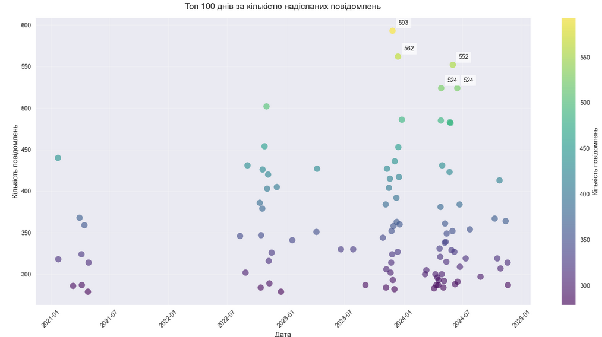
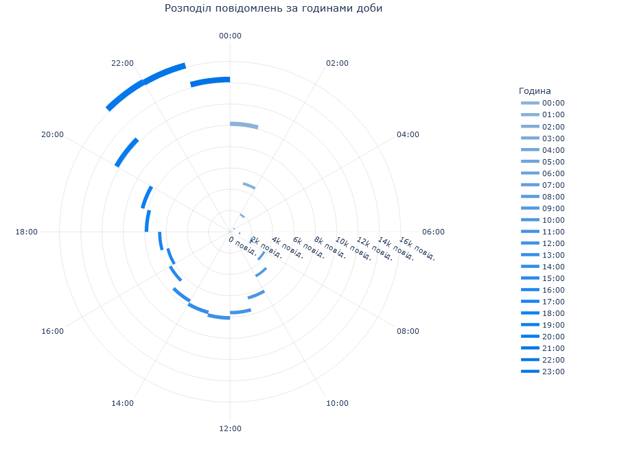
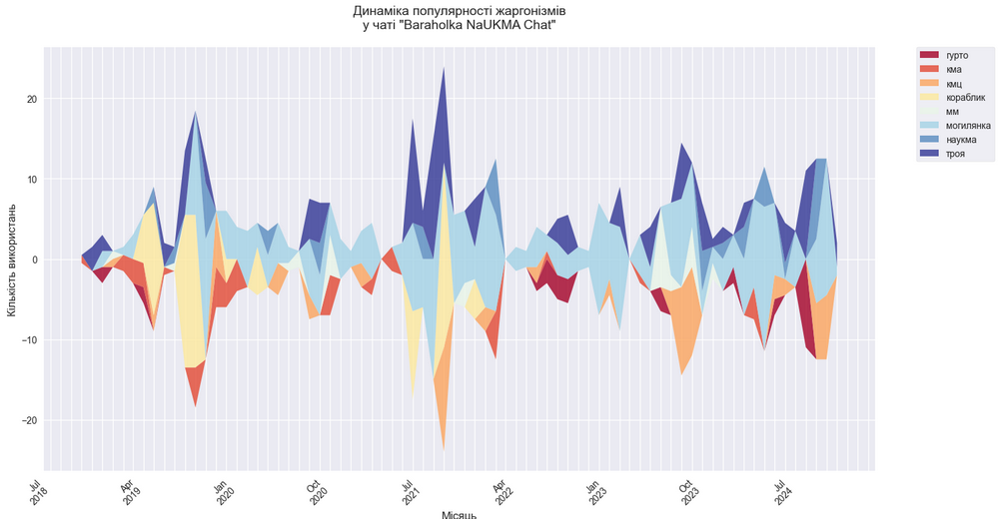

# telegram_data_analysis


## Overview
This project analyzes personal Telegram messaging data to uncover communication patterns,
interaction habits, and unique language usage within the NaUKMA (Kyiv-Mohyla Academy) community.
The analysis includes temporal patterns, reaction usage, and special focus on university-specific jargon.

## Key Features
- 📊 Comprehensive message statistics and visualization
- 🕒 Temporal pattern analysis (daily, weekly, monthly)
- 💬 Chat activity analysis (private vs. group)
- 👍 Reaction usage patterns
- 🎓 NaUKMA jargon analysis
- 📈 Interactive visualizations

## Project Structure
```
telegram_data_analysis/
├── data/                 # Data directory (not tracked in git)
├── load_data/           # Scripts for data loading
├── merge_data/          # Data merging utilities
├── notebooks/          # Jupyter notebooks with analysis
├── images/             # Screenshots and visualization outputs
└── docs/              # Additional documentation
```

## Usage

1. Start with the main analysis notebook:

    ```jupyter notebook notebooks/final_analysis.ipynb```
2. Follow the notebook sections for different types of analysis:
- Message frequency analysis
- Temporal patterns
- Reaction analysis
- Jargon usage patterns

## Sample Results




## Data Collection

1. Export your Telegram chat history (instructions in [load_data/README.md](./load_data/README.md))
2. Merge the exported data (follow [merge_data/README.md](./merge_data/README.md))
3. Place the merged data in the appropriate directory

## Installation and Setup

### Requirements
Python 3.10.10

### How to run
1. create virtual env
```python -m venv .venv```
2. activate virtual env

    For linux:
```. .venv/bin/activate```

    For Windows (PowerShell):
```.venv\Scripts\Activate.ps1```

3. install dependencies 
```pip install -r requirements.txt```

### How to start
1. ```cd ..```
2. ```jupyter notebook```

## Data Privacy and Usage
This project handles sensitive personal data. Please refer to [DATA_USAGE.md](DATA_USAGE.md) for:

- Data handling guidelines
- Privacy considerations
- Usage restrictions

## Future Improvements

### Language Processing Enhancements
- [ ] Integrate Ukrainian word forms dictionary for better word recognition
- [ ] Implement semantic analysis to understand context and meaning
- [ ] Utilize AI/NLP tools for improved context analysis of word usage patterns

### Data and Dictionary Improvements
- [ ] Enhance and optimize the CSV dictionary structure
- [ ] Expand the dictionary with additional categories:
  - Student slang
  - Professional jargon
  - Borrowed terms
  - General university terminology
- [ ] Develop tools for automatic detection of new jargon terms

### Technical Improvements
- [ ] Create an automated pipeline for data processing
- [ ] Implement real-time analysis capabilities
- [ ] Develop interactive visualization tools

## Contributing
Contributions are welcome! Please read the contribution guidelines before submitting pull requests.

## License
This project is licensed under the GPL-3.0 License — see the [LICENSE](LICENSE) file for details.

## Contact
- Email: zigzug.dima@gmail.com
- GitHub: [@AvdieienkoDmytro](https://github.com/AvdieienkoDmytro)
- Project Link: [telegram_data_analysis](https://github.com/AvdieienkoDmytro/telegram_data_analysis)

## Acknowledgments

- NaUKMA Computational Social Science course
- Course instructor: [Andrew Kurochkin](https://github.com/SanGreel)
- Special thanks to contributors of the [NaUKMA jargon dictionary](https://docs.google.com/document/d/1xzDY1cX7vtole9RAJ4X8dlbacKXXjGwOgfZb1o5Wf-Y/edit?tab=t.0)


